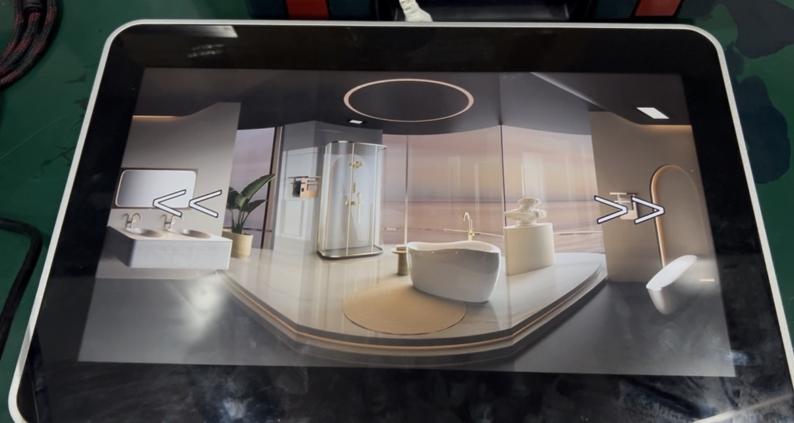

# Remote LED Changeable Content

This program broadcasts the video index to the [LED Changeable Content](https://github.com/cmmalana/LED-Changeable-Content) program, acting as a remote control for the interactive LED installation.

### Images

### Video Demo
[Watch on Facebook](https://www.facebook.com/share/v/1CoeLnPijQ/)

---

## Features
- Sends signals to the [LED Changeable Content](https://github.com/cmmalana/LED-Changeable-Content) program to change displayed content, acting as a remote control.  
- No IP configuration required — the program broadcasts signals across the local network using the same port.  

---

## Prerequisites
- Ensure that the Android tablet and the computer running [LED Changeable Content](https://github.com/cmmalana/LED-Changeable-Content) are connected to the same network.  
  - If the computer is using a static IP, configure the Android tablet to match the same IP range (e.g., all devices should be in `192.168.10.X`).  

---

## Setup
1. Configure static IPs for both the computer and the Android tablet if necessary.  
2. Run the [LED Changeable Content](https://github.com/cmmalana/LED-Changeable-Content) program on the computer.  
3. Launch **Remote LED Changeable Content** on the Android tablet.  
4. Test the functionality to ensure the remote is working correctly.  
